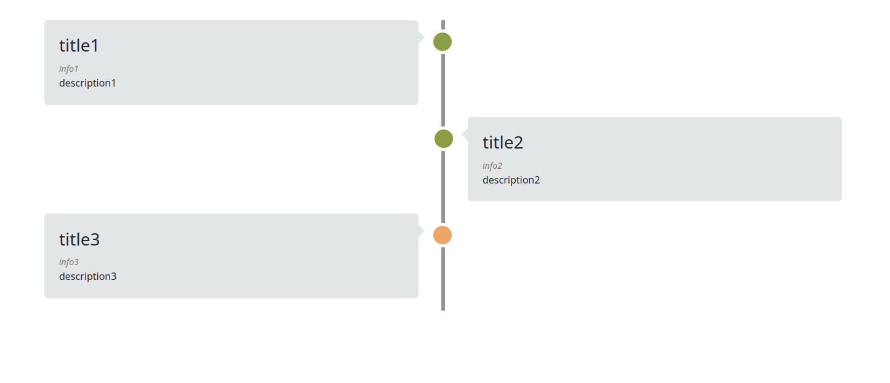

# @robindbl/ngx-timeline

This is an angular module that creates a timeline component. 



## Installation

Install the package using:

```
ng add @robindbl/ngx-timeline
```

(preferred)

or

```
npm install @robindbl/ngx-timeline
```


## Usage

Import the module in the app.module:

```
import { TimelineModule } from '@robindbl/ngx-timeline';

[...]
  imports: [
    [...]
    TimelineModule,
  ],
```

Then you can use the `ngx-timeline` in every component:

```
<ngx-timeline [data]="data"></ngx-timeline>
```

The `data` argument is required.

There are a few optional arguments:

`backgroundColor`: Change the background color of the timeline objects

`dotColor`: Change the color of the dots in the middle

`futureDotColor`: Change the color of the dots in the middle when `future` is enabled.

`rulerColor`: Change the color of the ruler in the middle.

## Data

The required `data` argument is an object. Here are its properties:

`title`: A string that shows the title of the event

`description`: The description of the event. This supports HTML tags

`info`: Extra information about the event. Can be used to specify the date

`position`: The position of the event: `left` or `right`.

`future`: If the event is a future event (not completed). This can be used to set the middle dot to a different color.

every property can be left empty. 